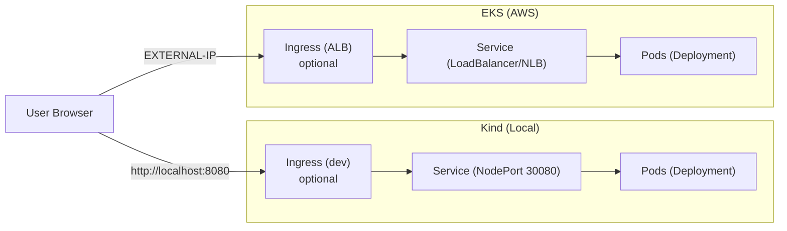

# Architecture

This project deploys a simple web application via Kubernetes using Kustomize overlays (`dev`, `prod`). The diagram illustrates request flow for both local Kind and AWS EKS.

Key points:
- Dev overlay exposes `Service` as NodePort 30080. With Kind port-mapping 30080→8080, open `http://localhost:8080`.
- Prod overlay exposes `Service` as `LoadBalancer` (NLB). Use the service `EXTERNAL-IP` or front with an ALB `Ingress` and DNS when needed.
